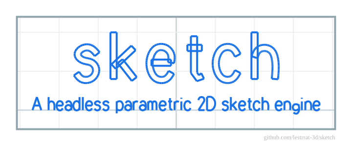
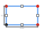
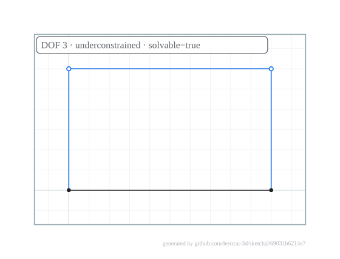
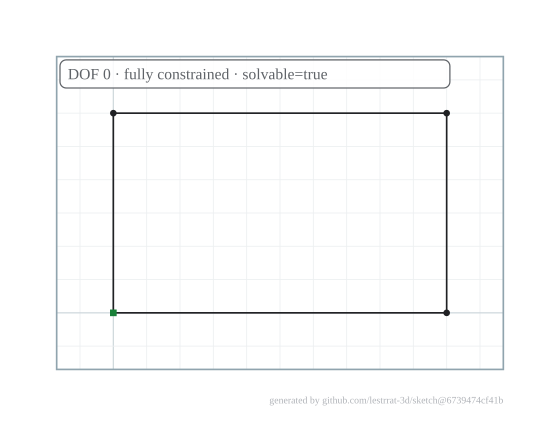
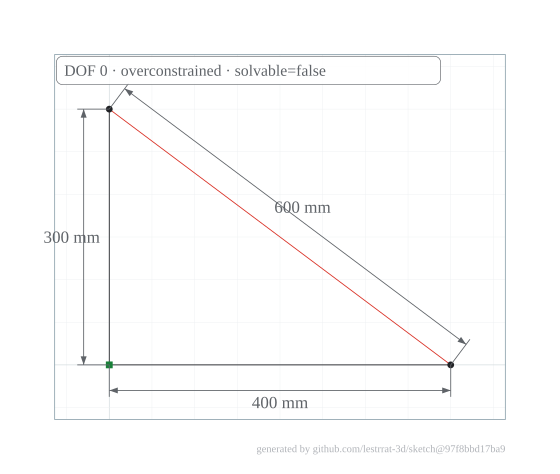
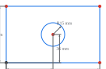
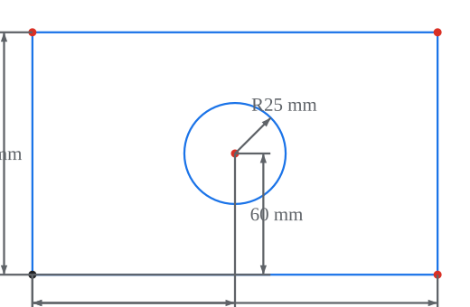
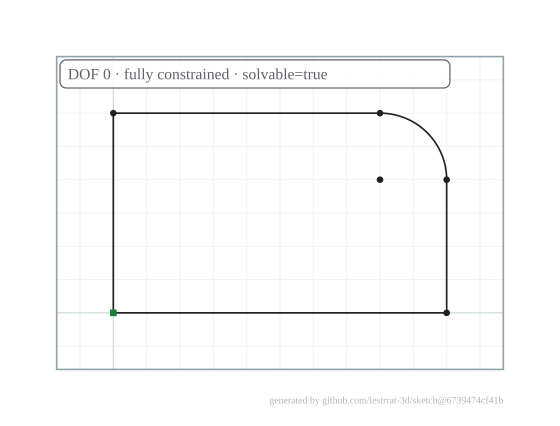
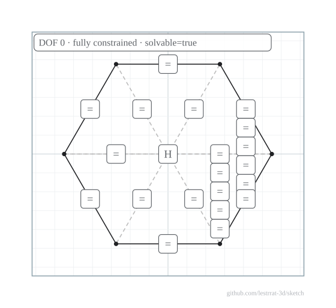

# sketch

<p align="center">
  
</p>

A standalone, fully programmable **parametric 2D sketch engine** for Go, in the
spirit of the sketch environment in Autodesk Fusion.

You build geometry — points, lines, circles, arcs, ellipses, splines — in code,
tie it together with geometric and dimensional **constraints**, and a numerical
solver moves the geometry so that every constraint is satisfied at once. Because
dimensions are ordinary editable values, sketches are fully parametric: change a
dimension, re-solve, and the geometry updates.

## Why this exists

This engine is built to be **driven by an AI agent as a verification step
before it acts on real CAD software**. Constraint sketching is easy to get
subtly wrong — an under- or over-constrained profile, a configuration that can
flip, a dimension that doesn't resolve as intended.

Rather than discover that inside Fusion *after* committing to an operation, an
agent can reproduce the sketch here first and check it programmatically: Does it
fully constrain (`DOF == 0`)? Are any constraints redundant or conflicting? Does
it admit more than one valid configuration?

Only once the sketch is proven sound does the agent carry the plan into the CAD
package — and the SVG/PNG exporters let an agent or human eyeball the result
along the way.

## Features

* **Levenberg–Marquardt constraint solver** with degrees-of-freedom and
  redundancy analysis.
* **A rich, Fusion-like constraint set** — coincidence, tangency, parallel,
  perpendicular, symmetry, equality and more — plus dimensional constraints
  that are editable and fully parametric.
* **Sketch-modification tools** — trim/extend/break, fillet/chamfer, mirror,
  rectangular/circular patterns, and offset — on committed geometry.
* **Verification diagnostics** — redundant/conflicting constraint detection,
  free-DOF attribution, over-constraint rejection, and a multi-solution
  ambiguity probe.
* **Units of measure and expression-driven dimensions** — typed units and a
  parameter/expression engine, so a single parameter can drive a whole sketch.
* **Profile (closed-region) detection** with exact areas and hole nesting.
* **Export** to **SVG** and **PNG** — optionally **annotated** with dimensions,
  constraint glyphs, degree-of-freedom coloring, conflict highlighting and a
  verification badge (see the Gallery) — plus **DXF** R12 (CAD interchange) and
  **JSON** (lossless save / load round-trip).
* **Pure Go, minimal dependencies.** The production runtime depends only on the
  standard library plus `github.com/lestrrat-go/option/v3`; the `geom`, `param`
  and `units` subpackages are standard-library-only and independently
  extractable.

```go
import "github.com/lestrrat-3d/sketch"
```

## Gallery

The exporters render **annotated** SVG, so you can *see* a sketch's constraints
and — the point of the engine — its verification state, not just its geometry.
Every image below is generated from a compiled builder by
`internal/cmd/genimages` and kept in sync by a test. Pass the `With…` options
(`WithDimensions`, `WithConstraints`, `WithDOFColoring`, `WithConflicts`,
`WithStatusBadge`, `WithProfileFill`) to `SVG`/`PNG`; all default off. The
gallery also renders "windowed" — `WithFrame` draws a border, `WithGrid` lays a
coordinate grid behind the sketch, and `WithWatermark` stamps a provenance
footer.

**Constraints and dimensions** — geometric-constraint glyphs (H/V = horizontal
/ vertical, ∥ = parallel, ⊥ = perpendicular) and CAD-style dimensions with
arrowheads and units:



**Degrees of freedom** — the headline verification cue. Geometry that is not
fully constrained is blue and hollow; fully constrained geometry is black. A
status badge reports the DOF count and constraint state:

| Under-constrained (a free corner) | Fully constrained |
|---|---|
|  |  |

**Conflicting constraints** — an over-constrained sketch highlights the geometry
whose constraints fight, in red, and the badge reports it is unsolvable:



**Parametric** — dimensions are editable values; change one and re-solve and
everything driven by it follows:

| width = 120 mm | width = 200 mm |
|---|---|
|  |  |

**Modification tools** — trim, fillet, chamfer, mirror, pattern and offset run
on committed geometry. A fillet, for example, replaces a sharp corner with a
tangent arc:

| Before | After (corner filleted) |
|---|---|
|  |  |

**Regular polygon** — a hexagon whose equal-length side and equal-spoke
constraints (the `=` glyphs) hold its regularity, then grounded to **DOF 0**: a
fixed center pins position, a horizontal construction diagonal pins rotation, and
a circumradius dimension pins size. Every edge is black (fully constrained) and
the badge confirms it:



## Quick start

You author geometry directly on the sketch from points: `s.CreatePoint(x, y)`
returns a solver-bound `*sketch.Point`, and the curve builders
(`s.CreateLine`/`CreateCircle`/`CreateArc`/`CreateEllipse`/`CreateSpline`) take those points.
Topology is expressed by sharing a point — the corner where two lines meet is
literally one `*Point`. Constrain the geometry, solve, edit a dimension, and
re-solve.

<!-- INCLUDE(examples/sketch_readme_example_test.go) -->
```go
package examples_test

import (
  "fmt"

  "github.com/lestrrat-3d/sketch"
)

// Example_sketch_quickstart builds an axis-aligned rectangle entirely from
// constraints, edits one dimension and re-solves, then exports the result. It
// is the smallest end-to-end taste of the engine: author geometry from points,
// constrain it, solve, edit, re-solve, export.
func Example_sketch_quickstart() {
  w := sketch.NewWorld()
  s, _ := w.CreateSketch(w.XY())

  // Four corners as rough initial guesses; the solver finds the exact spots.
  // Sharing a *Point between two lines is what makes a corner a corner.
  a := s.CreatePoint(0, 0)
  b := s.CreatePoint(18, 2)
  c := s.CreatePoint(17, 11)
  d := s.CreatePoint(1, 13)

  ab := s.CreateLine(a, b)
  bc := s.CreateLine(b, c)
  dc := s.CreateLine(d, c)
  ad := s.CreateLine(a, d)

  // Ground one corner at the origin so the sketch can't float away.
  a.MoveTo(0, 0)
  s.Fix(a)

  // Axis-align the four sides.
  s.AddConstraint(
    sketch.NewHorizontal(ab),
    sketch.NewHorizontal(dc),
    sketch.NewVertical(ad),
    sketch.NewVertical(bc),
  )

  // Driving dimensions: editable values that make the sketch parametric.
  width := sketch.NewDistance(a, b, 20)
  height := sketch.NewDistance(a, d, 12)
  s.AddConstraint(width, height)

  res, err := s.Solve()
  if err != nil {
    fmt.Printf("failed to solve: %s\n", err)
    return
  }
  fmt.Printf("DOF=%d b=(%.0f,%.0f) c=(%.0f,%.0f) d=(%.0f,%.0f)\n",
    res.DOF, b.X(), b.Y(), c.X(), c.Y(), d.X(), d.Y())

  // Edit a dimension and re-solve: the rectangle becomes 35 x 12.
  width.Set(35)
  if _, err := s.Solve(); err != nil {
    fmt.Printf("failed to re-solve: %s\n", err)
    return
  }
  fmt.Printf("after width.Set(35): b=(%.0f,%.0f) c=(%.0f,%.0f)\n",
    b.X(), b.Y(), c.X(), c.Y())

  // Export the solved sketch in several formats.
  svg, err := s.SVG()
  if err != nil {
    fmt.Printf("failed to render SVG: %s\n", err)
    return
  }
  dxf, err := s.DXF()
  if err != nil {
    fmt.Printf("failed to render DXF: %s\n", err)
    return
  }
  data, err := s.MarshalJSON()
  if err != nil {
    fmt.Printf("failed to marshal JSON: %s\n", err)
    return
  }
  fmt.Printf("exports non-empty: svg=%t dxf=%t json=%t\n", len(svg) > 0, len(dxf) > 0, len(data) > 0)

  // Output:
  // DOF=0 b=(20,0) c=(20,12) d=(0,12)
  // after width.Set(35): b=(35,0) c=(35,12)
  // exports non-empty: svg=true dxf=true json=true
}
```
source: [examples/sketch_readme_example_test.go](examples/sketch_readme_example_test.go)
<!-- END INCLUDE -->

The code blocks in this README are embedded from compiled, `go test`-verified
examples. For more worked programs — a constraint-built hexagon, a parametric
plate, a parametric fillet, an ambiguity probe — browse the
[`examples`](examples) package.

## Documentation

Task-focused guides live in [`docs/guide`](docs/guide):

* [Geometry](docs/guide/geometry.md) — builders, grounding, construction
  geometry, compound shapes, the `geom` shaping toolkit, and removal.
* [Constraints](docs/guide/constraints.md) — the geometric and dimensional
  constraint set, sign conventions, driven dimensions, and introspection/naming.
* [Units & parameters](docs/guide/units-and-parameters.md) — typed units and the
  expression engine that lets one parameter drive a whole sketch.
* [Profiles](docs/guide/profiles.md) — closed-region detection with exact areas
  and hole nesting.
* [Solving & goals](docs/guide/solving.md) — running the solver, reading its
  report, verification, interactive drag goals, and how the solver works.

The full API reference is on
[pkg.go.dev](https://pkg.go.dev/github.com/lestrrat-3d/sketch). Design notes and
engine internals are in [`docs`](docs).

## License

This project is **source-available**, and is licensed under the
[PolyForm Noncommercial License 1.0.0](LICENSE).

* **Noncommercial use is free.** Individuals, hobby and personal projects,
  research, education, nonprofits, and government may use, modify, and
  redistribute it at no cost, subject to the license terms.
* **Commercial / business use requires a separate license.** Any use by or for
  a business, or for commercial advantage, is not permitted under the
  noncommercial license. To obtain a commercial license, reach out on Bluesky
  at [@lestrrat.bsky.social](https://bsky.app/profile/lestrrat.bsky.social).

### Contributions

This repository does **not** accept external pull requests.
