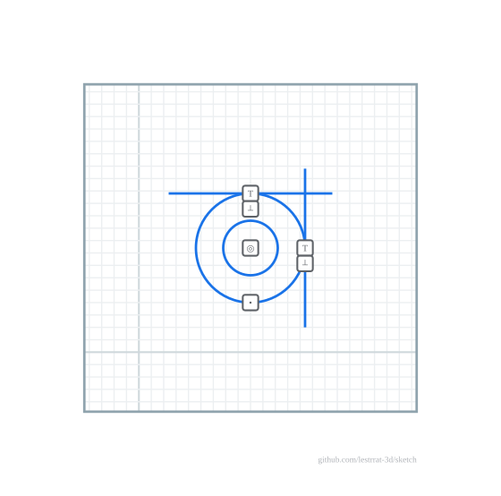
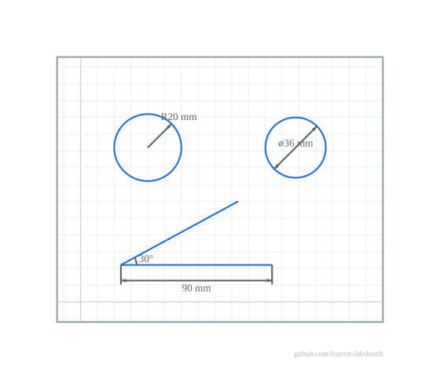
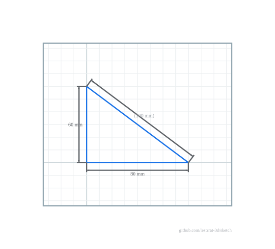

# Constraints

Construct a constraint with its `New…` function and commit it with
`s.AddConstraint(...)`.

## Geometric

`NewCoincident`, `NewHorizontal`, `NewVertical`, `NewParallel`,
`NewPerpendicular`, `NewPointOnLine`, `NewCollinear`, `NewPointOnCircle`,
`NewPointOnEllipse`, `NewMidpoint`, `NewSymmetric`, `NewConcentric`,
`NewEqual` (line lengths), `NewEqualRadius` (circles and/or arcs),
`NewTangent` (line to circle or arc), `NewTangentCircles` (circle/arc to
circle/arc, internal or external).

Tangency enforces the arc's sweep — the tangent must actually touch the arc,
not merely its underlying full circle. Tangency to splines, ellipses, conics
and NURBS is also available (`NewTangentToSpline`, `NewTangentEllipse`,
`NewTangentToConic`, `NewTangentToNURBS`, and the conic–conic family); see the
[package documentation](https://pkg.go.dev/github.com/lestrrat-3d/sketch) for
the full set and their point-on counterparts (`NewPointOnSpline`,
`NewPointOnEllipticalArc`, `NewPointOnConic`, `NewPointOnNURBS`, …).

Annotated SVG (`SVG(WithConstraints(true))`) draws a glyph for each geometric
constraint — here two circles held concentric (◎), a point kept on the outer
circle (•), and two lines tangent to it (T) that are perpendicular (⊥):

## Dimensional

Editable; each carries a unit and has a `.Set`/`.SetValue`.

`NewDistance`, `NewHorizontalDistance`, `NewVerticalDistance` (signed Δx/Δy),
`NewDistancePointLine` (perpendicular point↔line), `NewDistanceLines`
(perpendicular line↔line; forces the lines parallel), `NewOffset` (signed
parallel offset, positive on the left of the source line's direction),
`NewRadius`, `NewDiameter`, `NewAngle` (signed, counterclockwise from l1's
direction to l2's), `NewSemiMajor`/`NewSemiMinor` (ellipse semi-axes),
`NewEllipseRotation`.

Sign and side conventions matter: signed dimensions (`NewAngle`, `NewOffset`,
`NewHorizontalDistance`/`NewVerticalDistance`) pin a single configuration per
value, while unsigned constraints (`NewTangent`, `NewDistancePointLine`,
`NewDistanceLines`, `NewSymmetric`) keep whichever side the geometry starts
on. See "Orientation and sign conventions" in the
[package documentation](https://pkg.go.dev/github.com/lestrrat-3d/sketch).

`SVG(WithDimensions(true))` draws each as a CAD dimension — extension lines,
arrowheads and a unit-tagged value, with `R`/`⌀` prefixes for radius/diameter
and a swept arc for an angle:

## Driven (reference) dimensions

Any dimension can be flipped to a **driven (reference) dimension** with
`.SetDriven(true)`: it stops constraining the geometry and instead reports the
measured value — after each `Solve` its `.Target()` holds the measurement in
the dimension's own unit. `.SetDriven(false)` turns it back into a driving
dimension, keeping the last measured value as the new target.

Driven dimensions render parenthesized, the CAD convention for a reference
value. Here the two legs are driving distances (80, 60) and the hypotenuse is
driven — it measures the geometry rather than shaping it:

## Introspection & naming

Constraints can be inspected without type-switching the concrete handles:
`ConstraintKind` (a stable type id), `ConstraintRefs` (the points and entities
it references), `ConstraintResiduals` and `IsInternal`. Entities and
constraints also accept optional, non-unique names with first-match lookup
(`Point.SetName`/`s.PointByName`, `s.SetConstraintName`/`s.ConstraintByName`,
`s.EntityByName`), giving a DSL, GUI or test a durable, type-free handle. See
the [package documentation](https://pkg.go.dev/github.com/lestrrat-3d/sketch).
