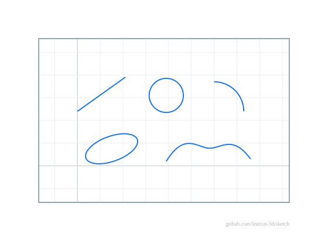
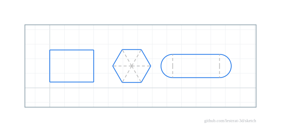

# Geometry

Author geometry on the sketch from points; each builder returns a solver-bound
handle:

| Builder | Bound handle |
|---|---|
| `s.CreatePoint(x, y)` | `*sketch.Point` (coordinates are solved for) |
| `s.CreateLine(p1, p2)` | `*sketch.Line` |
| `s.CreateCircle(center, r)` | `*sketch.Circle` |
| `s.CreateArc(center, start, end)` | `*sketch.Arc` |
| `s.CreateEllipse(center, rx, ry, rot)` | `*sketch.Ellipse` (semi-axes and rotation are solved for) |
| `s.CreateSpline(p0, p1, p2, p3, …)` | `*sketch.Spline` (clamped cubic B-spline) |

The curve builders take points you have already added; sharing a `*Point`
between entities is how topology is expressed (a shared corner is one point),
and each `Create…` creates a fresh entity. A bound handle exposes solved values
(`p.X()`, `l.Length()`, `c.R()`, `e.Rx()`) and a transient
[`geom`](../../geom) snapshot of its current shape via `Geometry()`.

A spline's control points are ordinary sketch points: constrain, dimension,
ground or drag (`WithGoal`) them and the curve follows — the curve itself
carries no extra unknowns. Clamping means the curve starts/ends exactly at the
first/last control points with end tangents along the outer control-polygon
legs, so endpoint attachment is point coincidence and end tangency is a
`NewParallel` on a construction line over the first leg. `sp.Eval(t)` /
`sp.Polyline(n)` evaluate the solved curve.

Beyond the common builders above, the engine also carries closed (periodic) and
fit-point splines, elliptical arcs, conics (rational quadratic Bézier) and
general NURBS as first-class geometry — each authorable, dimensionable,
profile-participating and serializable. See the
[package documentation](https://pkg.go.dev/github.com/lestrrat-3d/sketch) for
the full set.

## Grounding

* `p.MoveTo(x, y)` — move a point to `(x, y)` (sets the solver's starting guess).
* `s.Fix(p)` — pin a point at its current location.
* `s.Unfix(p)` — release a pinned point.

To ground a point at a specific location, move it first: `p.MoveTo(x, y)` then
`s.Fix(p)`.

Any entity can be marked as construction geometry with `e.SetConstruction(true)`
(rendered dashed/grey, exported to a separate DXF layer).

## Compound shapes

`s.CreateRectangle(x1, y1, x2, y2)`, `s.CreatePolygon(cx, cy, n, r)` and
`s.CreateSlot(x1, y1, x2, y2, r)` build a whole shape — primitives plus the
constraints that hold it in shape (horizontal/vertical sides; equal sides and
equal construction spokes; equal cap radii and perpendicular contact spokes) —
and return a grouping handle with the bound parts. The pieces are ordinary
sketch geometry/constraints and serialize as such; position and size stay free
to ground and dimension.

## Shaping templates (the `geom` toolkit)

Generic geometry can be shaped *before* committing: `geom` provides
intersection math (`LineLineIntersection`, `SegmentIntersection`,
`LineCircleIntersections`, `CircleCircleIntersections`, and arc variants
filtered by `Arc.Contains`) plus modification helpers — `SplitLineAt`,
`Fillet` (replaces a shared corner with a tangent arc, shortening both legs)
and `Chamfer` (straight cut). Commit the result with the usual `Create…` calls,
adding constraints to keep the shape parametric (e.g. tangency spokes, as
`CreateSlot` does).

## Removing geometry and constraints

`s.RemoveConstraint(c)`, `s.RemoveEntity(e)` and `s.RemovePoint(p)` undo
commits. Removing an entity cascades every constraint that references it
(including auto-added internal ones) but keeps its points — they may be
shared; remove orphans explicitly. `RemovePoint` refuses (returns false)
while any entity still uses the point. Removed handles are dead — discard
them; re-adding the same generic geometry creates a fresh instance. Sketch
documents carry a `"version"` field; legacy unversioned files still load.
