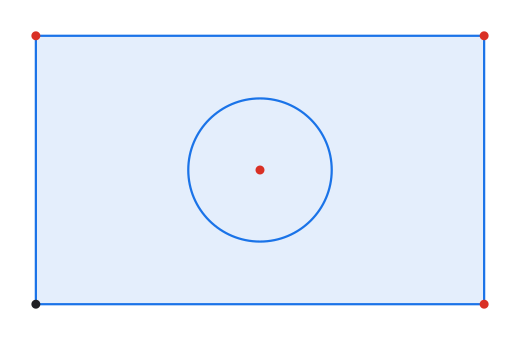
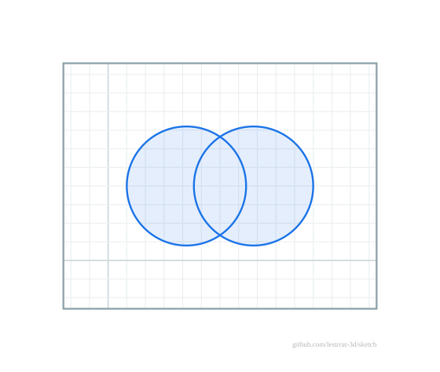

# Profiles

`s.Profiles()` detects closed planar regions via the `geom` arrangement engine:
every non-construction circle/ellipse and every closed loop of curves. Boundaries
that **cross without sharing a point are subdivided** into separate faces, a shape
inside another becomes a **hole** (nesting), and each region carries its net
`Area`, its `Outer`/`Holes` boundary edges, and validity flags
(`Valid`/`SelfIntersecting`) so a self-intersecting or degenerate region is caught
rather than silently trusted. Open chains and construction geometry contribute
nothing; reference geometry is included. Profiles are the input that future
extrude/revolve operations will consume, and `SVG(WithProfileFill(true))` shades
them:

Boundaries that cross without sharing a point are subdivided: two overlapping
circles become three faces — the two outer lunes and the central lens (where the
shading doubles) — each a region in its own right:

Region area is exact for every supported curve type — lines, arcs and circles
(shoelace plus an exact circular-segment correction), ellipses and elliptical
arcs, splines, conics and NURBS — so a reported `Area` is sampling-independent
for a whole curve rather than a polyline approximation.
