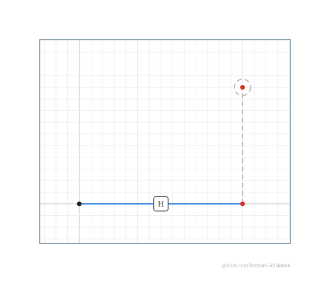

# Solving & goals

Call `Solve` (optionally tuned) and read the result it returns:

<!-- INCLUDE(../../examples/sketch_solving_example_test.go,Example_sketch_solving) -->
```go
// Example_sketch_solving solves a fully constrained sketch with tuned solver
// options and reports the fields the solver returns. DOF can also be queried
// directly, without moving any geometry.
func Example_sketch_solving() {
  w := sketch.NewWorld()
  s, _ := w.CreateSketch(w.XY())
  a := s.CreatePoint(0, 0)
  b := s.CreatePoint(30, 4)
  a.MoveTo(0, 0)
  s.Fix(a)
  l := s.CreateLine(a, b)
  s.AddConstraint(sketch.NewHorizontal(l))
  s.AddConstraint(sketch.NewDistance(a, b, 30))

  res, err := s.Solve(context.Background(),
    sketch.WithMaxIterations(200),
    sketch.WithTolerance(1e-10),
  )
  if err != nil {
    fmt.Printf("failed to solve: %s\n", err)
    return
  }
  fmt.Printf("converged=%t DOF=%d redundant=%d\n", res.Converged, res.DOF, res.Redundant)
  fmt.Printf("s.DOF()=%d\n", s.DOF())

  // Output:
  // converged=true DOF=0 redundant=0
  // s.DOF()=0
}
```
source: [../../examples/sketch_solving_example_test.go](../../examples/sketch_solving_example_test.go)
<!-- END INCLUDE -->

`Solve` reports:

* `res.Converged` — whether all constraints were satisfied within tolerance.
* `res.DOF` — remaining degrees of freedom (`0` means fully constrained).
* `res.Redundant` — number of redundant/conflicting constraint equations.
* `res.Iterations`, `res.Residual`.

`s.DOF()` reports the current degrees of freedom without moving any geometry.
`s.RedundantConstraints()` identifies *which* constraints are redundant (or
conflicting) at the current configuration — of two duplicates, the later-added
one is reported.

Annotated SVG makes the DOF verdict visible: not-fully-constrained geometry is
blue and hollow, fully constrained is black, and the grounded anchor is a green
square (`SVG(WithDOFColoring(true), WithStatusBadge(true))`):

| A free corner (`DOF 3`) | Fully constrained (`DOF 0`) |
|---|---|
|  |  |

If the solver cannot satisfy the constraints (typically an over-constrained or
contradictory sketch) `Solve` returns `ErrNotConverged` together with the
partial result.

For the headless-oracle use case, `s.Verify(ctx, …)` aggregates solvability, DOF,
status, redundant constraints, conflict sets, free points, profiles and their
validity into a single non-mutating `VerificationReport`, with an opt-in
multi-solution ambiguity probe (`WithProbe`). See the
[package documentation](https://pkg.go.dev/github.com/lestrrat-3d/sketch).

## Goals (interactive dragging)

`Solve` accepts soft targets — the engine primitive behind drag interactions:

<!-- INCLUDE(../../examples/sketch_goal_example_test.go,Example_sketch_goal) -->
```go
// Example_sketch_goal demonstrates a soft target (the primitive behind drag
// interactions): hard constraints always win, and the goal only pulls whatever
// freedom is left over.
func Example_sketch_goal() {
  w := sketch.NewWorld()
  s, _ := w.CreateSketch(w.XY())
  a := s.CreatePoint(0, 0)
  b := s.CreatePoint(2, 2)
  a.MoveTo(0, 0)
  s.Fix(a)
  l := s.CreateLine(a, b)
  s.AddConstraint(sketch.NewHorizontal(l)) // b must stay on the x-axis (y = 0)

  // Drag b toward (7, 5). The horizontal constraint pins y to 0; the goal is
  // free to pull the remaining x degree of freedom to 7.
  res, err := s.Solve(context.Background(), sketch.WithGoal(b, 7, 5))
  if err != nil {
    fmt.Printf("failed to solve: %s\n", err)
    return
  }
  fmt.Printf("b=(%.0f,%.0f) DOF=%d\n", b.X(), b.Y(), res.DOF)

  // Output:
  // b=(7,0) DOF=1
}
```
source: [../../examples/sketch_goal_example_test.go](../../examples/sketch_goal_example_test.go)
<!-- END INCLUDE -->



Constraints always win: the geometry settles at the closest feasible
configuration, and an unreachable target is not an error. Goals are transient
(per-call, never serialized, invisible to DOF/redundancy analysis). Issue one
goal per pointer-move event for dragging; several goals move whole selections.
Gesture policy (what dragging a line's body *means*) belongs to the UI layer —
see [`docs/goal-solve-design.md`](../goal-solve-design.md).

## How it works

All scalar unknowns form one parameter vector. Each constraint contributes one
or more residual equations, normalized to consistent units (lengths in length
units, angles dimensionless) so the system stays well conditioned. A
Levenberg–Marquardt least-squares solver with a numerical Jacobian drives the
residuals to zero; the rank of the Jacobian gives the degree-of-freedom and
redundancy analysis.
